>### DataBase Diagram / Entities
> ***
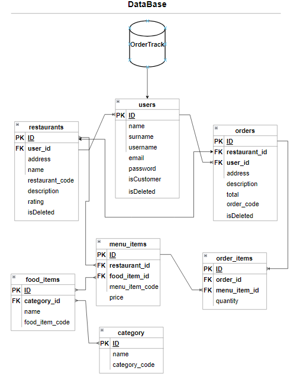
# Images from the project
***
> #### Login page
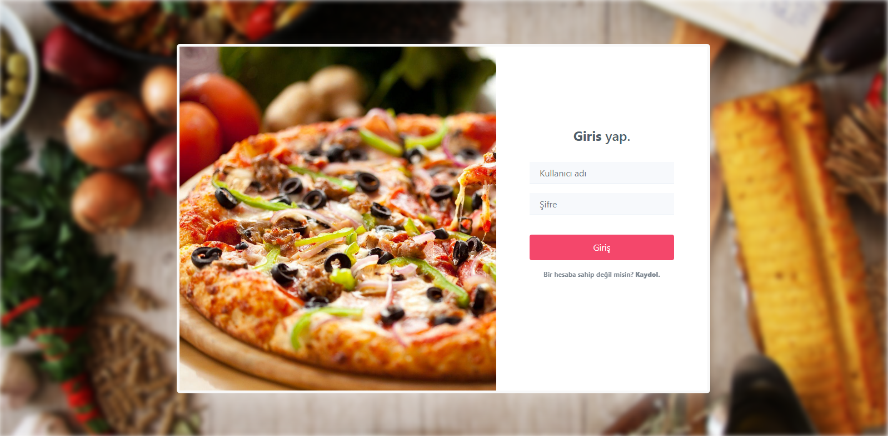
> #### Register page
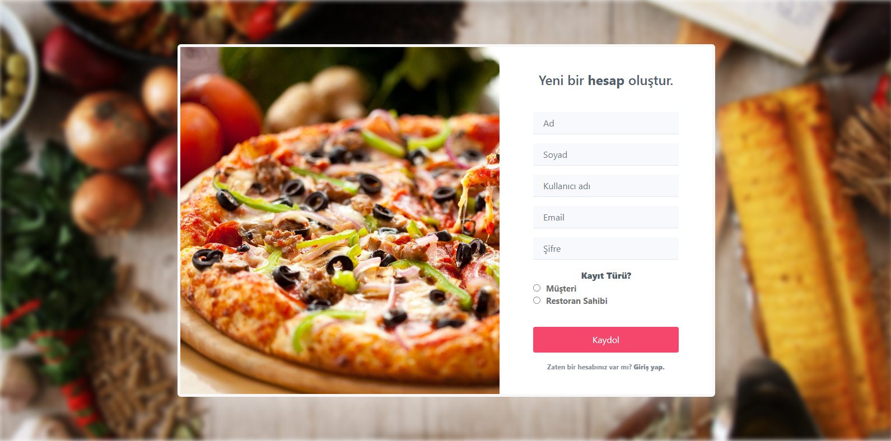
> #### Restaurants page
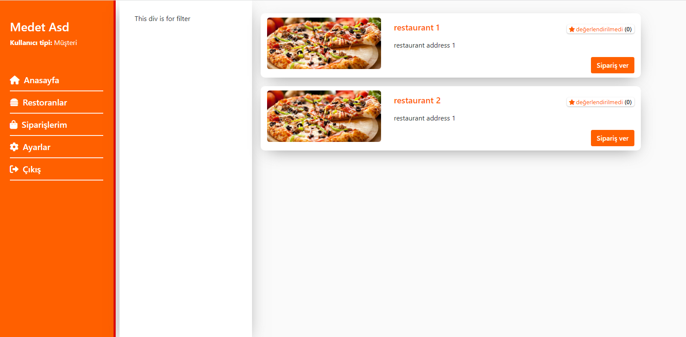
> #### Restaurant content page
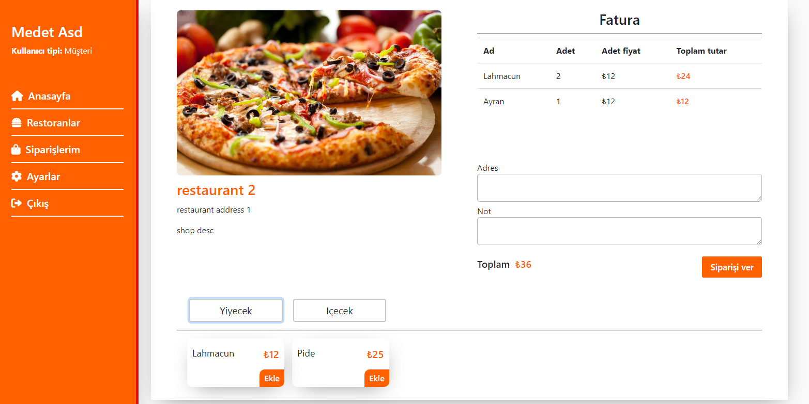
> #### My orders page
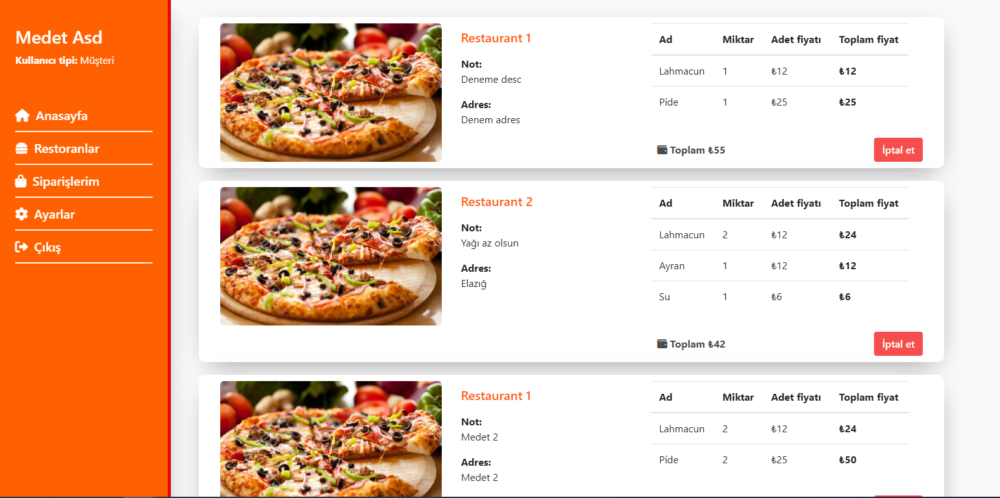
> #### Restaurant dashboard page
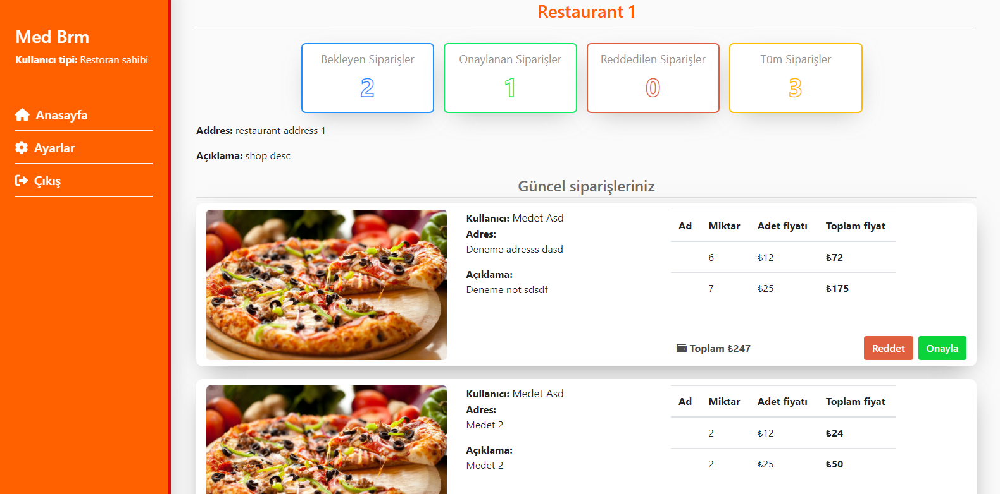
# Endpoints
***
> #### localhost:8080/api/auth/register 
* Create new a user

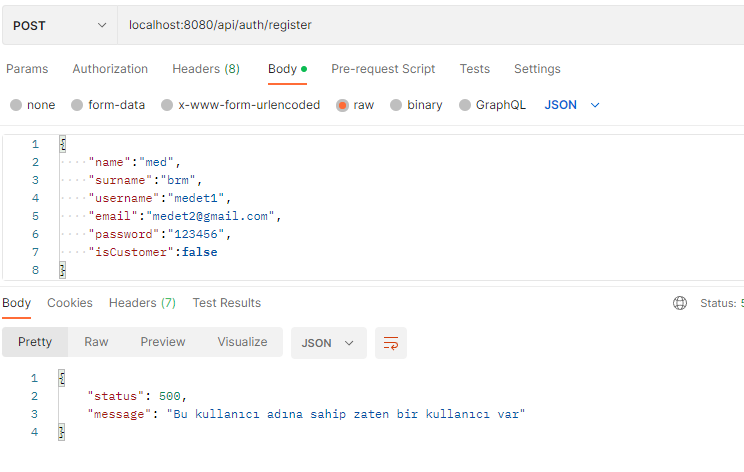
***
> #### localhost:8080/api/auth/login
* User login

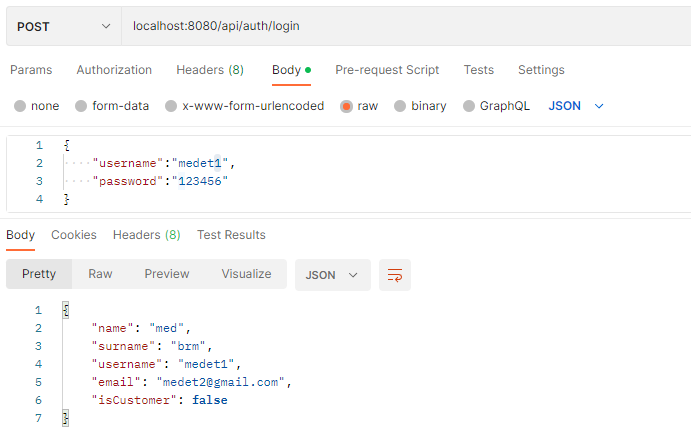
***
> #### localhost:8080/api/restaurants/
* Create new a restaurant

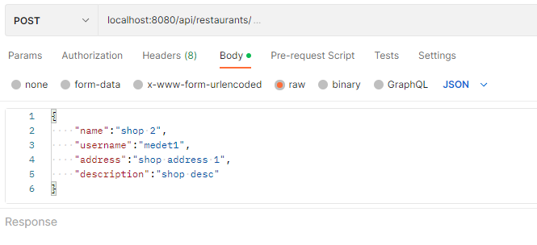
***
> #### localhost:8080/api/restaurants/
* Get all restaurant list

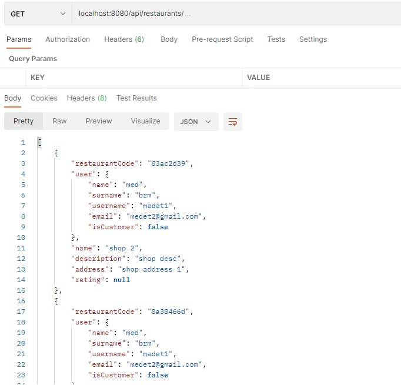
***
> #### localhost:8080/api/food-items/
* Create new a food item

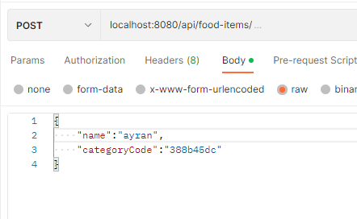
***
> #### localhost:8080/api/categories/
* Create new a category

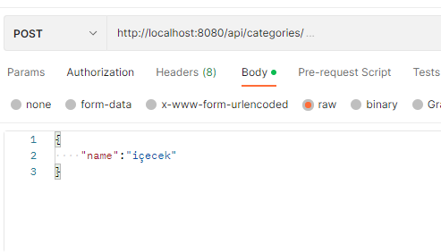
***
> #### localhost:8080/api/menu-items/
* Create new a menu item of restaurant

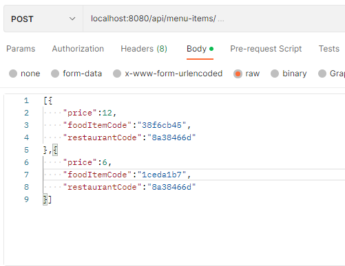
***
> #### localhost:8080/api/menu-items/83ac2d39
* Get menu items of restaurant by restaurant code

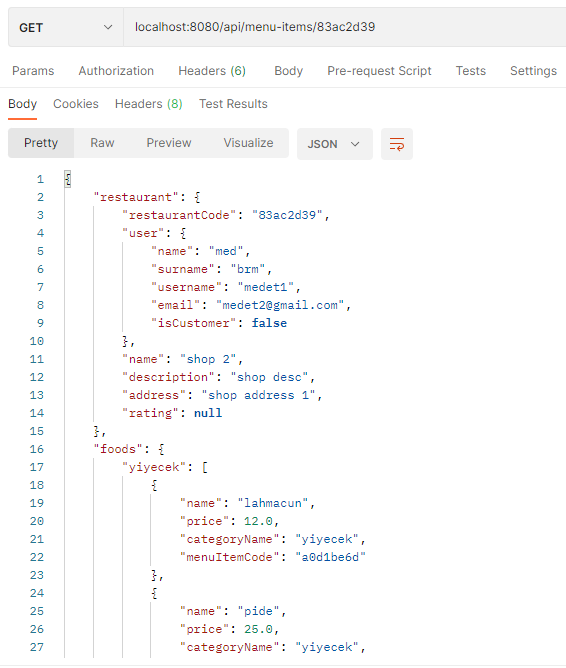
***
> #### localhost:8080/api/orders/
* Create new a order

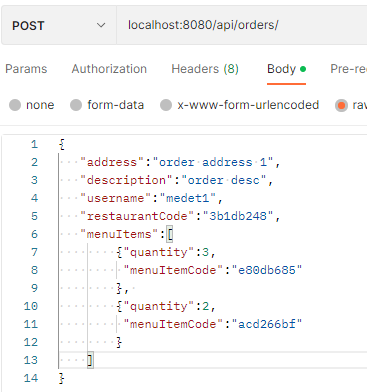
***
> #### localhost:8080/api/orders?username=medet1
* Get order list by username

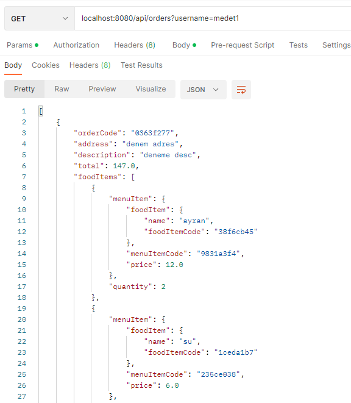
***
> #### localhost:8080/api/orders/83ac2d39
* Get order list by restaurant code

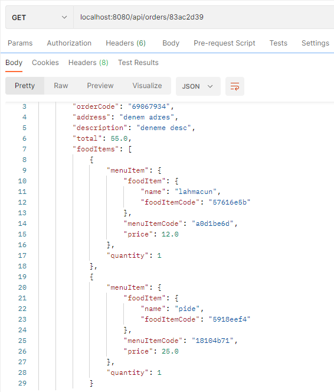